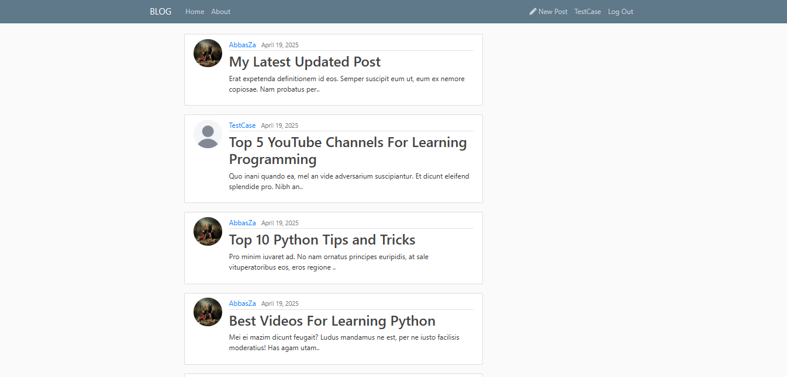
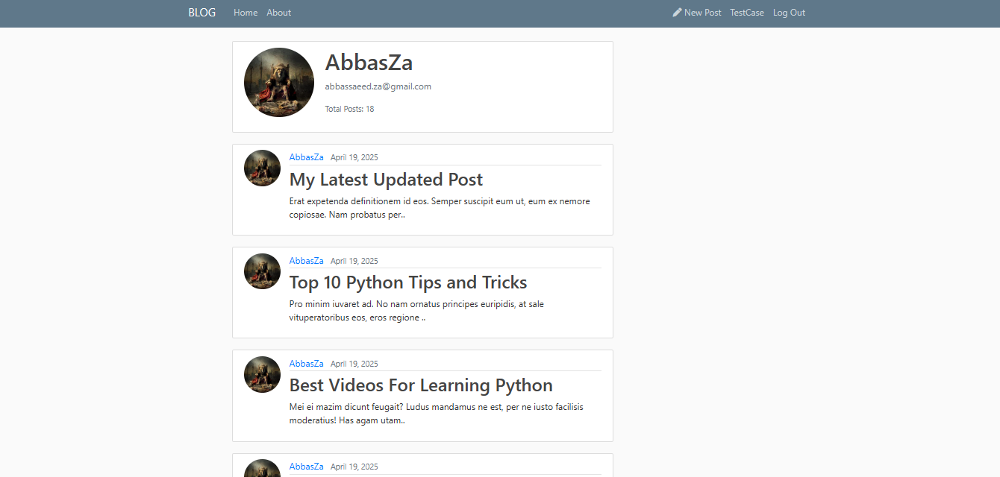

# BLOGGING APP (mainly backend)

solely for learning purposes

## Technologies Used:

-   Django Framework
-   Bootstrap (for shitty frontend)

### Concepts learned:

-   Setting up django project
-   Views (Custom and Built-in classes)
-   Customizing Forms
-   Models
-   Template

## How to host (locally)

1. Install dependencies `pip install -r requirements.txt`
2. Set **EMAIL_HOST_USER** and **EMAIL_HOST_PASSWORD**
3. run command `python manage.py runserver`

## Pages

Home Page

User Page

## Credits

-   Corey Schafer: [Youtube Channel](https://www.youtube.com/@coreyms/)
